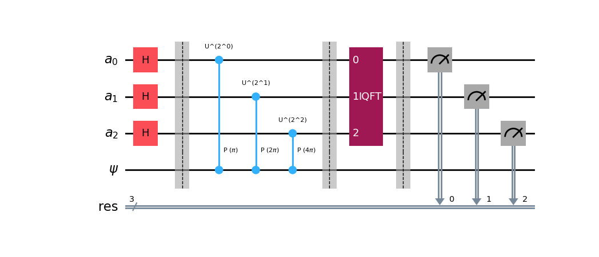
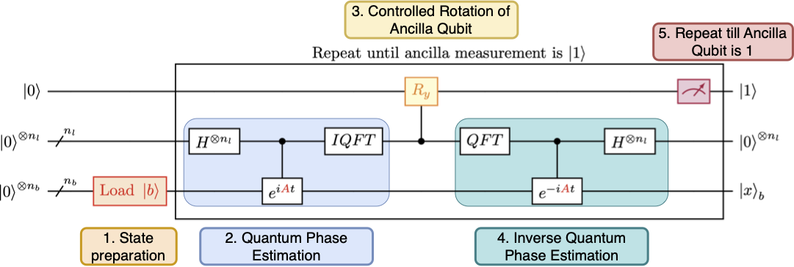

# Quantum Linear Solver Algorithm Challenge

Welcome to the ORNL Crash Course on Quantum Linear Solver Algorithms (QLSA) and their implications for the future of quantum computing! As we stand on the brink of a new era in computational technology, understanding the concepts and applications of quantum algorithms has never been more critical. This course is designed to equip you with the knowledge and skills necessary to navigate the evolving landscape of quantum computing and give you experience with running circuits on REAL quantum devices! 

Here we provide a sample implementation of a QLSA, the [Harrow–Hassidim–Lloyd (HHL)](https://doi.org/10.1103/PhysRevLett.103.150502) algorithm, using [Qiskit's HHL implementation](https://github.com/Qiskit/textbook/blob/main/notebooks/ch-applications/hhl_tutorial.ipynb). The implementation uses Python scripts that take advantage of Qiskit libraries. The codes are designed to run the QLSA circuit on REAL quantum devices:

1. [IQM](https://www.meetiqm.com/) (used in this crash course)
2. [IBM quantum-computing](https://quantum-computing.ibm.com/)

An application to fluid dynamics is also provided. The fluid dynamics use case follows the work of [Bharadwaj & Srinivasan (2020)](https://www.sto.nato.int/publications/STO%20Educational%20Notes/STO-EN-AVT-377/EN-AVT-377-01.pdf) and [Gopalakrishnan Meena et al. (2024)](https://doi.org/10.1063/5.0231929). 

## Significance of the HHL Algorithm
The HHL algorithm represents a monumental breakthrough in quantum computing, allowing for the efficient solution of linear systems of equations, a ubiquitous subtask that underlies numerous scientific and engineering applications. Traditional algorithms struggle with large-scale data sets, often resulting in extreme computational costs (O(N<sup>m</sup>) for solving N equations and m&ge;1). In contrast, the HHL algorithm harnesses the power of quantum mechanics to deliver an exponential (O(log N)) speedup, enabling faster computations that can solve complex problems in fields such as optimization, machine learning, and fluid dynamics!

Understanding the HHL algorithm not only showcases the unique advantages of quantum computing but also opens the door to innovative applications that were previously unimaginable in classical computing. As we work through this challenge, we will explore the foundational principles and mathematical theory behind subroutines in the HHL algorithm. For specifics on how quantum computing works, please see our [`Python_QML_Basics`](../Python_QML_Basics) challenge.

## Quantum Algorithms Primer

Before we jump into the coding section, let's discuss the differences between classical and quantum algorithms. In fact, one common misconception is that quantum computers will outright replace classical computers. The truth is actually much more nuanced! Quantum algorithms are not designed to replace traditional computing algorithms; instead, they excel at solving specific types of problems that classical computers struggle with. 

See our [`Python_QML_Basics`](../Python_QML_Basics) for a quick review of the differences between classical and quantum computing. Another misconception is that quantum computers can solve problems that classical computers cannot. This is also **not** true! Quantum computers might seem like magic, but they're really only capable of solving classical computations faster and (ideally) with fewer resources than normal computers. In fact, it is partially because of this that we can "simulate" quantum computers classically, which you will be doing in this course. 

In this course, we will be using:
1. Simulators - which mimic QPUs using classical computing.
2. Emulators - which are like simulators, but they add a noise profile calibrated from the real hardware.
3. Real hardware (or quantum processing unit, QPU) - actual quantum computing hardware provided by IQM. 

The focus of quantum algorithms is to leverage quantum principles such as superposition, entanglement, and quantum interference to perform computations in ways that classical computers cannot. 

One way of leveraging quantum mechanics for computing is by using one of the most important subroutines in quantum computing, the quantum phase estimation (QPE). QPE is a foundational technique in many quantum algorithms, including the HHL algorithm, that allows us to estimate the phase (or even the eigenvalue itself) associated with a quantum state. Given it's prevalence in many quantum algorithms, we believe it's important to give you a primer on how it works. Additionally, by understanding QPE, we will see a gentle introduction to the nuances of developing quantum algorithms compared to classical!

> **Please note that our intention is not to scare you away with terminology. If you find any terms in the following explanation confusing (don't worry, you're not alone), please reach out if any topics are not clear!**

### Quantum Phase Estimation (QPE) Steps

1. ***Setup*** 
      * Start with a quantum state, usually in the form of |ψ⟩, that is an eigenstate of a unitary operator **U**.
          * An aside: An "eigenstate" (or "eigenvector") is a type of quantum state that represents a specific result of measuring a physical quantity (like energy, spin, or momentum). The possible result itself that can be measured is known as an "eigenvalue". For example, if I'm measuring the energy (`E`), maybe some of the values I could measure are `E_1`,`E_2`, `E_3`, etc. (those are the possible "eigenvalues" or outcomes of my system). If my quantum state (|ψ⟩) is an eigenstate representing `E_1`, for example, then that means when I go and measure the energy then I will expect to measure the `E_1` value with 100% certainty.
          * In QPE, it is essential to begin this way, so that the phase accumulation in step 4 is predictable and the final measurement in step 6 is efficient.
          * Additionally, using a unitary operator is necessary to preserve information about our state. See the section on "Gates" in [`Python_QML_Basics`](../Python_QML_Basics) for more information.
      * The function looks like this **U**|ψ⟩ = e<sup>2πiθ</sup>|ψ⟩, where e<sup>2πiθ</sup> is the eigenvalue of |ψ⟩, **i** represents the imaginary component of the complex amplitude, and **θ** is the phase we want to estimate.
2. ***Quantum Registers***: Prepare two quantum registers (i.e., sets of qubits):
      * The **ancilla register** is used to store the phase estimation and is initialized to ∣0⟩ states.
          * The more qubits that are in the **ancilla register**, the higher the precision of our measurement.
      * The **target register**, ∣ψ⟩, is the register from which we want to extract phase information.
          * Preparation of |ψ⟩ will be problem-specific. For instance, it can be initialized as an equal superposition of |0⟩ and |1⟩, or some other complex state built from a series of gates.
      * This step is important because we want the ancilla qubits to be in a state capable of representing multiple outcomes simultaneously and the target state ∣ψ⟩ needs to be prepared such that we can derive the phase value by the end.
3. ***Hadamard Transformation***
      * Apply a Hadamard transformation (i.e., using Hadamard gates in our circuit) to the ancilla qubits in the ancilla register; thereby, putting the ancilla qubits in a superposition representing all possibilities of our quantum system (which makes all possibilities have equal probability). 
      * This step essentially enables quantum parallelism since our initial state can now capture multiple simultaneous outcomes.
      * Additionally, by placing the ancilla register in a superposition of states, we are enabling the ancilla register to interact with ∣ψ⟩ in such a way that useful information about the phase of ∣ψ⟩ can be obtained through interference later on.
4. ***Controlled Unitaries*** 
      * For each qubit **a** (also known as control qubit) in the ancilla register, apply the controlled unitary operation U<sup>2<sup>**a**</sup></sup> to the state ∣ψ⟩ in such a way that it depends on the eignevalue's binary expansion.
      * In other words, the unitary operation is only applied to the target register when the **a**-th ancillary quibit equals |1⟩.
      * After performing the controlled unitary operation, the overall state of the quantum system can be thought of as a mix of different possibilities (i.e., a superposition) for the ancilla qubits, each corresponding to a piece of phase information related to the target qubit's eigenstate.
5. ***Inverse Quantum Fourier Transform (IQFT)***
      * At this point, the phase information is not easily measured. Therefore, the inverse quantum Fourier transform is applied to the ancilla qubits.
      * Essentially, the most probable states in the ancilla register would constructively interfere with one another, leading them to have higher amplitudes.
      * The IQFT transforms the phase information encoded in the amplitudes of the ancilla qubits into a basis state that can directly represent the estimated phase.
6. ***Measure the ancilla qubit register***
      * The states measured by the qubits within the ancilla register will yield an **approximation** of the phase θ.
      * Remember, quantum computing is inherently probabilistic, so the precision of the estimation is determined by the number of ancilla qubits in the ancilla register.
      * When the ancilla qubit is measured, it collapses to one of the basis states (i.e., |0⟩ or |1⟩) with a probability given by the square of the amplitudes.
      * The measured outcome, **k**, relates to the phase, **θ** as follows: θ = **k**/2<sup>**a**</sup>, where **a** is the number of qubits in the ancilla register.

Here's how the above description might look as a quantum circuit:

The following example is a QPE circuit for a Z-gate using 3 ancilla qubits.
<p align="center" width="100%">
    
</p>

### Walkthrough of the HHL algorithm

Now, let's go over the HHL algorithm, guided by some exemplary code snippets. A detailed walkthrough of the algorithm can be found in [Qiskit's tutorial](https://github.com/Qiskit/textbook/blob/main/notebooks/ch-applications/hhl_tutorial.ipynb). Here, we provide guidance on the overall procedure, as a background to run the codes. For a system of $N$ linear equations $A\vec{x}=\vec{b}$ (size of $A$ is $N \times N$), the objective of the HHL algorithm is to represent the solution vector $\vec{x}$ in terms of the eigenbasis of the $A$ matrix:
$$\ket{x} = A^{-1} \ket{b} = \sum_j \lambda^{-1}_jb_j\ket{u_j}$$
where $\lambda_j$ and $\ket{u_j}$ are the $j$-th eigenvalue and eigenvector of $A$, and the classical states are rescaled and represented as quantum states (with the $\ket{\cdot}$ notation). We can achieve this with 5 steps, a sample depiction of which is shown below
<p align="center" width="100%">
    
</p>

#### Step 1: State preparation of $\vec{b}$
The first step is to represent the $\vec{b}$ vector from classical state to quantum $\ket{b}$, called state preparation. One way to do this is to normalize $\vec{b}$ and use amplitude encoding - $j$-th component of $\vec{b}$ corresponds to the amplitude of the $j$-th basis state of the quantum state $\ket{b}$. We need $n_b=\log_2N$ qubits to encode $\vec{b}$. 
> **Note that $N$ needs to be a power of 2.**

If `vector` is a numpy array representing $\vec{b}$, we can perform amplitude encoding by
```
from qiskit.circuit import QuantumCircuit
nb = int(np.log2(len(vector)))
vector_circuit = QuantumCircuit(nb)
vector_circuit.initialize(
      vector / np.linalg.norm(vector), list(range(nb))
      )
```
Here, the `QuantumCircuit` class initializes a Qiskit representation of a quantum circuit using `nb` qubits that are needed to encode the `vector`. The `QuantumCircuit.initialize` function initializes the quantum states with the vector provided.

#### Step 2: QPE for eigenvalue estimation of $A$
Next, we estimate the eigenvalue of $A$ using QPE. To use QPE, we need to first encode $A$ as a unitary operation (as mentioned in the [QPE section](#quantum-phase-estimation-qpe-steps)). We can encode $A$ as the Hamiltonian of the unitary gate $U=e^{iAt}$, which can be achieved by Trotterization. 
> **Note that for the operation to work, $A$ must be Hermitian.**

As discussed in the QPE section, the controlled qubits (in the ancilla register) store the states of the eigenvalues of $A$ after the IQFT step within the QPE algorithm. The accuracy depends on the number of controlled qubits, $n_l$, which we determine based on the condition number of $A$. If `matrix` is a 2D numpy array representing $A$, we can perform these operations as
```
# initialize matrix class
matrix_circuit = NumPyMatrix(matrix, evolution_time=2 * np.pi)

# condition number of matrix
kappa = matrix_circuit.condition_bounds()[1]

# Update the number of qubits required to represent the eigenvalues
# The +neg_vals is to register negative eigenvalues because
# e^{-2 \pi i \lambda} = e^{2 \pi i (1 - \lambda)}
nl = max(nb + 1, int(np.ceil(np.log2(kappa + 1)))) + neg_vals

# perform QPE
from qiskit.circuit.library import phase_estimation as pe
pe_circuit = pe.PhaseEstimation(nl, matrix_circuit)
```
Here, the `NumPyMatrix` is a class that stores `matrix` and evolution time to perform the matrix exponent. It also has functionalities like returning the condition number of `matrix`. The `PhaseEstimation` function from the Qiskit library returns the QPE circuit.

#### Step 3: Controlled rotation of ancilla qubit
Once we have the eigenbasis, the ancilla qubit is rotated using a controlled rotation gate based on the eigenvalues. One way to generate this reciprocal circuit `reciprocal_circuit` is by Piecewise Chebyshev approximation of the function as shown [here](https://github.com/jw676/quantum_linear_solvers/blob/a94cf634f77a9061c95baf95b4d3bf6baa9de477/linear_solvers/hhl.py#L470).

#### Step 4: Inverse QPE
While technically we are now, ready to measure the solution state on the $n_b$ qubits (see Step 5), the solution vector cannot be obtained in terms of $\ket{0}$ and $\ket{1}$ as the $n_b$ qubits are entangled with the $n_l$ qubits. Thus, we need to perform an un-compute operation, using inverse QPE, to un-entangle the two qubit registers and the solution vector $\ket{x}$ is stored in the $n_b$ registers as $\ket{0}$ or $\ket{1}$ measurements. Inverse QPE can be done by simply:
```
pe_circuit.inverse()
```
Combining all the components, the full HHL circuit is given by:
```
# Initialise the quantum registers
from qiskit.circuit import QuantumCircuit, QuantumRegister, AncillaRegister
qb = QuantumRegister(nb)  # right hand side and solution
# If state preparation is probabilistic the number of qubit flags should increase
nf = 1
qf = QuantumRegister(nf)  # flag qubits
ql = QuantumRegister(nl)  # eigenvalue evaluation qubits
qa = AncillaRegister(na)  # ancilla qubits

# Initialize the quantum circuit
qc = QuantumCircuit(qb, ql, qa, qf)

# Add state preparation circuit of vector
qc.append(vector_circuit, qb[:])

# Add QPE circuit
qc.append(
      pe_circuit, ql[:] + qb[:] + qa[: matrix_circuit.num_ancillas]
      )

# Add controlled rotation circuit
qc.append(reciprocal_circuit, ql[::-1] + [qf[0]])

# Add QPE inverse circuit
qc.append(
      pe_circuit.inverse(),
      ql[:] + qb[:] + qa[: matrix_circuit.num_ancillas],
      )

# return qc
```

#### Step 5: Measure ancilla and extract solution state
At this stage, if the ancilla qubit is measured, it should collapse to $\ket{1}$ for the solution state to be stored in the $n_b$ qubit registers. If $\ket{0}$ is measured, the results are discarded and the process is repeated until $\ket{1}$ is measured. 

We note that measuring the entire solution state can lead to loss of the computational advantage of the HHL algorithm and thus practically, only an observable of the system (like the mean or norm of the state) is measured as the outcome. For educational purposes, in the current code and challenge, we will extract the entire solution vector $\ket{x}$ for comparison with the true solution state $\vec{x}$.

The detailed code with all the components can be found [here](https://github.com/jw676/quantum_linear_solvers/blob/a94cf634f77a9061c95baf95b4d3bf6baa9de477/linear_solvers/hhl.py#L323).

### Workflow of the code

The codebase comprises two main Python scripts: [`circuit_HHL.py`](circuit_HHL.py) and [`solver.py`](solver.py). The first generates the HHL circuit and the second runs it with a specific backend (simulator, emulator, or QPU). Our codebase follows the following workflow for solving a given system of linear equations:

#### 1. Create your matrix and vector
* Code: [`circuit_HHL.py`](circuit_HHL.py)

The `get_matrix_vector()` function in [`func_matrix_vector.py`](func_matrix_vector.py) returns the matrix and vector for various candidate cases. Various cases can be added here and the parameters defined in the input file [`input_vars.yaml`](input_vars.yaml). Given the case info stored using an argument parser variable (see [`circuit_HHL.py`](circuit_HHL.py)), this function can be called as
```
import func_matrix_vector as matvec
matrix, vector, input_vars = matvec.get_matrix_vector(args)
```

#### 2. Generate the HHL circuit
* Code: [`circuit_HHL.py`](circuit_HHL.py)

Generate the HHL circuit using the following function call. First, we call the `HHL` class using a simulator backend, followed by the circuit construction call.
```
from qiskit_aer import AerSimulator
backend = AerSimulator(method='statevector')

from linear_solvers import HHL
hhl = HHL(quantum_instance=backend)

circ = hhl.construct_circuit(matrix, vector)
```
The code snippets discussed in the [HHL section](#walkthrough-of-the-hhl-algorithm) are embedded in this function, defined in this [code](https://github.com/jw676/quantum_linear_solvers/blob/a94cf634f77a9061c95baf95b4d3bf6baa9de477/linear_solvers/hhl.py#L323).

#### 3. Run the HHL circuit
* Code: [`solver.py`](solver.py)

Finally, we run the generated HHL circuit using a given backend - simulator, emulator, or QPU. The main function call is [`qc_circ()`](https://github.com/olcf/hands-on-with-odo/blob/f3c1ff9c4adfa9ad7f6d77d7fe139a86f893689b/challenges/Python_QLSA/solver.py#L74), encompassed in the script [`func_qc.py`](func_qc.py). The process of running the circuit involves (1) selecting and initializing the [backend](https://github.com/olcf/hands-on-with-odo/blob/f3c1ff9c4adfa9ad7f6d77d7fe139a86f893689b/challenges/Python_QLSA/func_qc.py#L95), (2) [transpile](https://github.com/olcf/hands-on-with-odo/blob/f3c1ff9c4adfa9ad7f6d77d7fe139a86f893689b/challenges/Python_QLSA/func_qc.py#L119) the circuit for the particular backend, and (3) [run](https://github.com/olcf/hands-on-with-odo/blob/f3c1ff9c4adfa9ad7f6d77d7fe139a86f893689b/challenges/Python_QLSA/func_qc.py#L159) the transpiled circuit.

### Implications of quantum algorithms

One final thing to note before diving into the code, is the significance of probabilistic computing. Imagine you used your phone to take a photo of the beautiful Smoky Mountains, but when you went to show your friends, you couldn't find the photo! The next day, you contemplate how odd that was, so you look once more in your photos folder and the Smoky Mountains are magically there! You repeat this over and over, but the photo only shows up some of the time. If you measured how often you saw the photo, you would notice that there is a probability associated with its appearance (maybe around 50%). Afterwards, you'd throw your phone away with 100% probability because that's no way to maintain a filesystem!

Hopefully, this idea cements why quantum computers will never outright replace classical; however, this "weird" behavior does mean that we have to carefully consider how we interpret our calculations. To obtain reliable estimates, we need to run the quantum circuits multiple times. We call each iteration of our run a "**shot**". To obtain statistically relevant results, the more shots of our circuit we run, the better! 

For example, if you'd flip a coin 3 times (i.e., 3 shots), and got heads each time, you might say you'd have a 100% probability of getting heads if you stopped there. We know this isn't true! In fact, if you flipped the coin 1000 times (1000 shots), you'd see the probability of getting heads or tails is roughly 50%, as expected.

In this crash course, we will observe the effects of the number of shots has on our final results. So without further ado, let's begin coding!

## Setting Up Our Environment
First, we will move to the challenge directory, unload all current modules you may have previously loaded on Odo, and deactivate any previously loaded environments. 
```
# Move to the challenge directory (assuming you cloned the repo in your home directory)
$ cd ~/hands-on-with-odo/challenges/Python_QLSA/

# Unloads any active conda envs (if applicable)
$ source ~/hands-on-with-odo/misc_scripts/deactivate_envs.sh

# Resets to default modules
$ module reset
```
Next, we will load our miniforge module (analogous to an open-source minconda), and activate the appropriate conda environment for this exercise.
```
$ module load miniforge3
$ source activate /gpfs/wolf2/olcf/stf007/world-shared/9b8/crashcourse_envs/qlsa-solver
```
The path to the environment should now be displayed in `"( )"` at the beginning of your terminal lines, which indicates that you are currently using that specific conda environment.
If you check with `which python3`, you should see that you're properly in the new environment:

```
$ which python3
/gpfs/wolf2/olcf/stf007/world-shared/9b8/crashcourse_envs/qlsa-solver/bin/python3
```

## Overview of How to Run

### Obtaining your IQM Key

Before running the code, it is important to obtain your IQM token so that you can run the circuits on actual quantum devices.

1. Log in to your IQM account at https://resonance.meetiqm.com

2. In the "Your Account" menu (click on your initials in the top-right corner), click the circular arrows in the "API Token" section.

3. Generate a new token and copy it. 

4. Open the [`keys.sh`](keys.sh) file, and replace `IQM_API_KEY="my_iqm_api_key"` with the token you just copied. (Note: make sure your token is encapsulated by the double-quotes)

5. Save and close the `keys.sh` file. 

6. In your terminal, do the following:
```
$ source keys.sh
```

### (Optional) Testing the Code 

It is also advisable to test the code first to ensure the environment is set up correctly.

1. Test Qiskit installation: [`test_qiskit_installation.py`](test_qiskit_installation.py)
      ```
      $ python3 test_qiskit_installation.py -backtyp ideal
      ```
      <details><summary>Sample output from the test code:</summary>

      ```
      Backend: QasmSimulator('qasm_simulator')

      Total count for 00 and 11 are: {'00': 494, '11': 506}
              ┌───┐      ░ ┌─┐   
         q_0: ┤ H ├──■───░─┤M├───
              └───┘┌─┴─┐ ░ └╥┘┌─┐
         q_1: ─────┤ X ├─░──╫─┤M├
                   └───┘ ░  ║ └╥┘
      meas: 2/══════════════╩══╩═
                            0  1 
      ```
      </details>
      Running the test script more than once shows the inherent randomness of Quantum Computing!
      Notice how the "Total count" changes if you test the script more than once!

1. Test the quantum linear solver package: [`test_linear_solver.py`](test_linear_solver.py)
      ```
      $ python3 test_linear_solver.py -nq 2
      ```
      <details><summary>Sample output from the test code:</summary>
      
      ```
      Simulator: AerSimulator('aer_simulator')
      ======================
      Time elapsed for classical:  
      0 min 0.00 sec
      Time elapsed for HHL:  
      0 min 0.21 sec
      ======================
      HHL circuit:
            ┌──────────────┐┌──────┐        ┌─────────┐
      q9_0: ┤0             ├┤4     ├────────┤4        ├
            │  circuit-165 ││      │        │         │
      q9_1: ┤1             ├┤5     ├────────┤5        ├
            └──────────────┘│      │┌──────┐│         │
      q10_0: ───────────────┤0     ├┤3     ├┤0        ├
                            │  QPE ││      ││  QPE_dg │
      q10_1: ───────────────┤1     ├┤2     ├┤1        ├
                            │      ││      ││         │
      q10_2: ───────────────┤2     ├┤1 1/x ├┤2        ├
                            │      ││      ││         │
      q10_3: ───────────────┤3     ├┤0     ├┤3        ├
                            └──────┘│      │└─────────┘
      q11: ─────────────────────────┤4     ├───────────
                                    └──────┘                 
      ====================== 
      Euclidean norm classical:    
      1.237833351044751
      Euclidean norm HHL:        
      1.2099806231118977 (diff (%): 2.250e+00)
      ======================
      Classical solution vector:
      [1.14545455 0.43636364 0.16363636 0.05454545]
      HHL solution vector:
      [1.11266151 0.43866345 0.16004585 0.08942688]
      diff (%): 
      [ 2.86288363  0.52703993  2.1942013  63.94928497]
      ```
      </details>

### Running the QLSA Code

The instructions below are mainly for **running interactively** on OLCF Odo. The first time you run the Python scripts, it may take some time to load the libraries.

The general workflow is to (1) Start an interactive job (or batch job) to use Odo's compute nodes, (2) Load the appropriate Python `conda` environment, (3) Generate the circuit, (4) Run the QLSA solver with the circuit you just generated, and (5) Analyze your results

1. Start interactive job
    ```
    $ salloc -A PROJECT_ID -p batch -N 1 -t 0:30:00
    ```

2. Load Python environment:
    * When targeting real quantum backends, you must go through a [proxy server for connecting outside OLCF](https://docs.olcf.ornl.gov/quantum/quantum_software/hybrid_hpc.html#batch-jobs) due to the Odo compute nodes being closed off from the internet by default. 
      ```
      $ source ~/hands-on-with-odo/misc_scripts/proxies.sh
      ```
    * First, load the relevant conda module:
      ```
      $ source ~/hands-on-with-odo/misc_scripts/deactivate_envs.sh
      $ module load miniforge3
      ```
      Activate the environment needed for circuit generation and solution:
      ```
      $ source activate /gpfs/wolf2/olcf/stf007/world-shared/9b8/crashcourse_envs/qlsa-solver 
      ```
3. Run QLSA circuit generator script: [`circuit_HHL.py`](circuit_HHL.py)
   Before we run the solver in step #4, we first have to generate the circuit that will be used.
    ```
    $ srun -N1 -n1 -c1 python3 circuit_HHL.py -case sample-tridiag -casefile input_vars.yaml --savedata
    ```
    > **WARNING:** make sure to save the generated circuit with `--savedata` flag; otherwise, you will be unable to run the QLSA solver in the next step.
4. Run the QLSA solver: [`solver.py`](solver.py)
   Running the `solver.py` code uses the circuit previously generated and runs the QLSA on a specific backend for a given amount of shots.
    ```
    $ srun -N1 -n1 -c2 python3 solver.py -case sample-tridiag -casefile input_vars.yaml -s 1000 --savedata -backtyp ideal
    ```
    * The above example uses 1000 shots (e.g., `-s 1000`) and a simulator backend (e.g., `-backtyp ideal`).
    * To run the script on actual hardware, use the `-backtyp real-iqm -backmet garnet` flags.
    > **WARNING:** make sure to save the runs you want with `--savedata` flag; otherwise, you will be unable to generate a plot for the objectives.

5. Plot your results: [`plot_fidelity_vs_shots.py`](plot_fidelity_vs_shots.py)
    ```
    $ python3 plot_fidelity_vs_shots.py
    ```
  
> **Note:** Alternative to all of the above, you can use the batch script [`submit_odo_example.sh`](submit_odo_example.sh) to [submit a batch job on OLCF Odo](https://docs.olcf.ornl.gov/systems/frontier_user_guide.html#batch-scripts) using `sbatch --export=NONE submit_odo_example.sh`. The `submit_odo_example.sh` example batch script is already setup with the above steps; however, modifying that file is required if you want to change any python script arguments (like shot count).

## Challenges

Now that you've tested out the code and environment, let's get to the challenge objectives!
You'll be using a simulator, emulator, and real quantum hardware to study the fidelity of each method over a range of shots.
Below are the two objectives:

1. Shots-based study. **Objective:** Determine the convergence of the accuracy (fidelity) with the number of shots.
     * Make a plot that demonstrates the convergence of fidelity for solving a system of equations with matrix size 2 × 2 (default `input_vars`). Shot range from 100 to 1,000,000.
     * Report your deductions of the converged shot value (How does the fidelity of the results change when you vary the shots parameter? When does the fidelity start being pretty consistent?).
          * Put your answer in a new file called `convergence.txt`.
     * Run on simulator only (i.e., `-backtyp ideal`).
          * Example arguments: `-case sample-tridiag -casefile input_vars.yaml -s NUMBER_OF_SHOTS_HERE --savedata -backtyp ideal`

2. Backend evaluation. **Objective:** Compare the results for running the circuits on simulators, emulators, and real devices.
     * Compare fidelity to `Objective 1` above on the emulator and the actual quantum hardware -- make a plot that compares all three methods.
     * Due to limitations of the hardware, limit your shot range from 100 to 20,000 shots.
     * Use the Fake Garnet emulator (i.e., `-backtyp real-iqm -backmet fake_garnet`).
          * Example arguments: `-case sample-tridiag -casefile input_vars.yaml -s NUMBER_OF_SHOTS_HERE --savedata -backtyp real-iqm -backmet fake_garnet`
     * Use IQM’s real Garnet system (i.e., `-backtyp real-iqm -backmet garnet`).
          * Example arguments: `-case sample-tridiag -casefile input_vars.yaml -s NUMBER_OF_SHOTS_HERE --savedata -backtyp real-iqm -backmet garnet`

> **Hint:** [`plot_fidelity_vs_shots.py`](plot_fidelity_vs_shots.py) can be executed after running all of the production runs for every shot and backend combination for Objective 1 and 2 to help you compare.

# References
* A. W. Harrow, A. Hassidim, and S. Lloyd, "Quantum algorithm for linear systems of equations," [Phys. Rev. Lett. 103, 150502](https://doi.org/10.1103/PhysRevLett.103.150502) (2009).
* S. S. Bharadwaj and K. R. Sreenivasan, "Quantum computation of fluid dynamics," [arXiv:2007.09147](https://doi.org/10.48550/arXiv.2007.09147) (2020).
* M. Gopalakrishnan Meena, K. C. Gottiparthi, J. G. Lietz, A. Georgiadou, and E. A. Coello Pérez, "Solving the Hele-Shaw flow using the Harrow-Hassidim-Lloyd algorithm on superconducting devices: A study of efficiency and challenges," [Physics of Fluids, 36 (10): 101705](https://doi.org/10.1063/5.0231929), (2024). ([preprint](http://arxiv.org/abs/2409.10857), [code](https://doi.org/10.5281/zenodo.13738192) - the current repo is adapted from this code)
* [Qiskit - Getting started](https://qiskit.org/documentation/getting_started.html)
* [Qiskit on IQM](https://iqm-finland.github.io/qiskit-on-iqm/user_guide.html)

# Cite this work

* Gopalakrishnan Meena, M., Gottiparthi, K. C., Lietz, J. G., Georgiadou, A., and Coello Pérez, E. A. (2024). Solving the Hele–Shaw flow using the Harrow–Hassidim–Lloyd algorithm on superconducting devices: A study of efficiency and challenges. [Physics of Fluids, 36(10).](https://doi.org/10.1063/5.0231929)
* Gopalakrishnan Meena, M., Gottiparthi, K., & Lietz, J. (2024). qlsa-hele-shaw: Solving the Hele-Shaw flow using the Harrow-Hassidim-Lloyd algorithm on superconducting devices. Zenodo. https://doi.org/10.5281/zenodo.13738192


