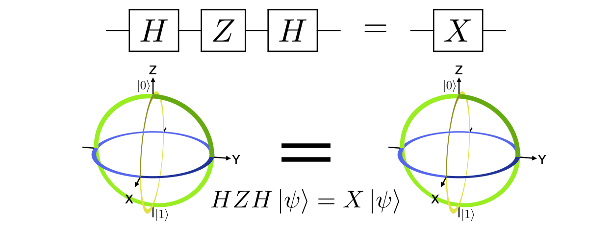
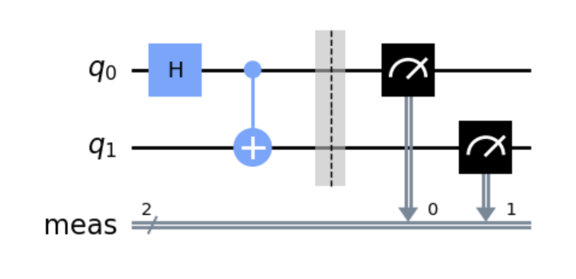
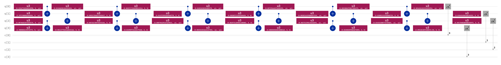

# Quantum Machine Learning Basics

> Written by: Samuel T. Bieberich (@Sam-Bieberich) and Michael A. Sandoval (@michael-sandoval)

One of the most promising forms of unconventional computing is Quantum Computing (QC), which utilizes quantum mechanics to perform calculations on qubits. These qubits are analogous to binary bits in classical computers; however, they can exploit some different properties, including:

1. Superposition - the ability of a qubit to be in more than one state at once, measured as a "1" or "0" only a percentage of the time. 
2. Entanglement - the ability of two qubits to connect across theoretically infinite amounts of space, making them directly related. 

Quantum Computers are well equipped to handle processes like those in Convolutional Neural Networks and machine learning (ML), optimized for computing linear algebra matrix calculations and weighted cost functions. Combining quantum computing with ML results in quantum machine learning (QML). This scientific domain is currently in its infancy, but as soon as more effective quantum computers are built, Quantum Processing Units (QPUs) may be working on the same scale as GPUs and TPUs in the ML space.

In theory, quantum computers are much more scalable than current HPC infrastructure, slowed by the steady decline of [Moore's Law](https://en.wikipedia.org/wiki/Moore%27s_law). Given this over-idealized outlook, the question remains, ***why would HPC need to be involved at all?***

**The general answer is**: At this stage, instead of viewing QC as completely replacing classical HPC, the goal is to integrate QC into a "hybrid" QC/HPC ecosystem. The two can work together to accomplish tasks that they're *each* good at, similar to how a GPU works along with CPUs for specific tasks and not for others. So, similar to how a GPU is used to accelerate certain parts of code, we can view a QPU as an accelerator that can speed up certain demanding, exponential-scaling calculations in a scientific code.

This tutorial will highlight a "hybrid" QC/HPC ecosystem, where you will use a virtual (simulated) QPU to train an ML model using transfer learning. The challenge problem itself focuses on how to efficiently distribute parallel tasks, so you won't need to know any of the quantum theory, but this allows you to get a glimpse of the quantum computing world.

## Setting Up Our Environment

First, we will unload all the current modules that you may have previously loaded on Odo, and then immediately load the default modules.
Assuming you cloned the repository in your home directory:

```bash
$ cd ~/hands-on-with-odo/challenges/Python_QML_Basics
$ source ~/hands-on-with-odo/misc_scripts/deactivate_envs.sh
$ module reset
```

The `source deactivate_envs.sh` command is only necessary if you already have existing conda environments active.
The script unloads all of your previously activated conda environments, and no harm will come from executing the script if that does not apply to you.

Next, we will load the GNU compiler module (most Python packages assume GCC), the GPU module:

```bash
$ module load PrgEnv-gnu/8.6.0 
$ module load rocm/6.1.3
$ module load craype-accel-amd-gfx90a
$ module load miniforge3
```

We loaded the "base" conda environment, but we need to activate a pre-built conda environment that has PennyLane and PyTorch.
Due to the specific nature of conda on Odo, we will be using `source activate` instead of `conda activate` to activate our new environment:

```bash
$ source activate /gpfs/wolf2/olcf/stf007/world-shared/9b8/crashcourse_envs/qml-odo
```

The path to the environment should now be displayed in "( )" at the beginning of your terminal lines, which indicates that you are currently using that specific conda environment.
If you check with `which python3`, you should see that you're properly in the new environment:

```bash
$ which python3
/gpfs/wolf2/olcf/stf007/world-shared/9b8/crashcourse_envs/qml-odo/bin/python3
```

## Quantum Primer

Before we run the code, it is important to understand the process that the code will perform. We will start by analyzing quantum computing and figuring out why it is so readily optimized into ML applications.

### Qubits

In classical computing, there are "Bits", while quantum computing has Quantum Bits or "Qubits". Although they are both used to represent information, they are quite different.

* A **Bit** is the smallest unit of measuring information in classical computing, and it can only have one of two values: 0 or 1 (i.e., a binary digit).

* A **Qubit** is the smallest unit of information measurement in quantum computing. Unlike classical bits, a quantum bit can have multiple states at the same time. Meaning, a quantum bit can have a combination of 0 and 1 simultaneously. This property of Qubits is known as **superposition**.

A classical binary bit can only represent a single binary value, such as 0 or 1, meaning that it can only be in one of two possible states. A qubit, however, can represent a 0, a 1, or any proportion of 0 and 1 in superposition of both states, with a certain probability of being a 0 and a certain probability of being a 1.

Superposition allows quantum algorithms to process information in a fraction of the time it would take even the fastest classical systems to solve certain problems. This is because the amount of information a qubit system can represent grows exponentially. Information that 500 qubits can easily represent would not be possible with even more than 2^500 classical bits. For example, it would take a classical computer millions of years to find the prime factors of a 2,048-bit number, while Qubits could perform the calculation in just minutes (in theory).

### Bloch Sphere

Measuring a Qubit many times results in probabilities (or "counts") of 0s and 1s. Due to the complex nature of the probabilities a given qubit may represent, the "Bloch Sphere" is a way of geometrically visualizing a qubit's state.

Mathematically, a qubit’s state can be described with two complex numbers. A complex number has a real part and an imaginary part. From these two complex numbers, three real numbers are calculated that determine a point on or in the Bloch sphere. A vector originating at the center of the sphere and terminating at that point represents the state of the qubit.

The state vector originates in the center of the sphere and terminates at a point with z, x, and y coordinates.

* The z-axis represents the probability of the qubit being measured as a 0 or a 1.
* The x-axis represents the real part of the state vector.
* The y-axis represents the imaginary part of the state vector. 

The Bloch Sphere is a unit sphere upon which various rotations of a primary vector can represent quantum superposition states. If the vector points straight up, it's 0; if it points straight down, it's 1. Since there are technically infinite points on the surface of a sphere, it is logical that there are infinitely many unique quantum states. By rotating the "red line" on the GIF graphic below, you can note how the parts of the vector pointing towards 1 and 0 vary, thus representing the odds of measuring each binary state. 




Quantum Circuits perform transformations on the Bloch Sphere by using gates. These gates all fundamentally shift the primary vector in the graphic to point at a different part of the surface of the sphere. Composed like musical notes on staves (don't worry non-musicians), these circuits can be either simple, like the entanglement circuit below, or complex, like the bottom image. 





The complex image directly above is what we are going to be designing today! But, no worries, as this whole process is automated. The script below takes the input states of the training and puts them on the left of the stave/circuit, then uses various quantum rotation gates to make the weightings point more toward the 1 or the 0.

When a quantum state is measured, it collapses to one of these states with a probability. While this may seem like a bother to electrical engineering designers, it is actually very helpful, not to mention one of the defining features of quantum physics! 

If you recall the training on just ML, you will notice that all the talk about weightings and initial states being modified to have optimal outputs sounds very familiar. That is the primary reason QML is one of the most sought-after applications in the field of quantum computing: it is a natural process for model training!

### Gates 

Just for clarity before we start wading into the deep end in the following sections, it would be best to define some of the most basic quantum gates. Some are very similar to classical Boolean logic gates, but others are particularly strange to people without physics backgrounds. 

It is worth mentioning that quantum gates have to be this way due to the limitations of quantum physics. As per Google Bard:

> Quantum gates are unitary because they are implemented by the action of a Hamiltonian for a specific time, which gives a unitary time evolution according to the Schrödinger equation. The unitarity property of quantum mechanics restricts the evolution of quantum states. This means that every operation on a normalized quantum state must keep the sum of probabilities of all possible outcomes at exactly 1. Therefore, any quantum gate must be implemented as a unitary operator and is therefore reversible. 

Classical gates such as the NAND gate (one of the Universal gates) are not reversible, and thus can't be translated to quantum circuits. This is a bummer since having quantum universal gates would be nice, but instead, there are universal gate sets, which are composed of 2-5 gates that, when combined, are universal in scope. More can be read about these gate sets below, or in the linked Wikipedia article. 

#### X (NOT)

Flips the qubit polarity (N to S or S to N), exactly the same concept as the classical NOT gates in every computer on Earth. These gates are often not used alone though, but rather in parallel with a control bit which "activates" the X if another qubit is a 1 or 0. These are called CNOT gates and can be stacked with other combinations as well (CCNOT, CCCNOT, etc.).

#### H (Hadamard)

Puts a qubit into (or out of) a superposition state. Many are used in each circuit, and most qubits are at least put into superposition one time, as this is the main advantage they have over classical bits. In fact, when combined with a Toffoli gate (the fancy name for CCNOT), it is the simplest universal quantum gate set. 

#### RY (Y-axis Rotation)

Along with RX and RZ gates (of which this code doesn't focus as much), it rotates the vector in the Bloch Sphere representation of the qubit. This particular gate rotates around the Y axis. 

#### More info

https://en.wikipedia.org/wiki/Quantum_logic_gate

Now, onto the actual tutorial!

## Looking at the code

Our `qml.py` code replaces the final layer of a pre-trained network with a special quantum computing layer. We will analyze the `qml.py` code and determine how it works before running. 

First, the imports:

### Imports

```python
import time
import os
import copy

# PyTorch
import torch
import torch.nn as nn
import torch.optim as optim
from torch.optim import lr_scheduler
import torchvision
from torchvision import datasets, transforms
import torch.multiprocessing as mp
from torch.nn.parallel import DistributedDataParallel as DDP
import torch.distributed as dist

# Pennylane
import pennylane as qml
from pennylane import numpy as np

torch.manual_seed(42)
np.random.seed(42)
```

Obviously, some, such as `time` and `os` are used to check the runtime of the circuit for the output to be in a format we can read.

All of the PyTorch imports allow for the ML part of the QML implementation. Like the section covering PyTorch in the [Python_Pytorch_Basics](../Python_Pytorch_Basics) tutorial, PyTorch will be used to set up a neural network. The `DDP` import is important, ensuring that the code can be run in parallel on multiple GPUs or nodes.

[PennyLane](https://pennylane.ai/) is a Python library for designing quantum circuits or programs from Xanadu, a Canadian quantum computing company. Pennylane has some great [demos](https://pennylane.ai/qml/demonstrations/), and much of our OLCF tutorial is based on a version of their [Quantum Transfer Learning](https://pennylane.ai/qml/demos/tutorial_quantum_transfer_learning) demo.

Lastly, setting the "seed" for both NumPy and PyTorch makes sure the script is reproducible upon re-execution and is consistently using the same random data sampling.

### Hyperparameters

One of the most important parts of an ML program is the definition of hyperparameters. The most important hyperparameter in QML involves the number of qubits being used in the program. The default in this example is 4, but it can be anywhere from 1-30 based on the backend we are using (before you run into memory errors). When you are running the `qml.py` code, you can experiment by changing the `n_qubits` value and seeing how it affects the output. Keep in mind, the code is designed to run at 4 qubits, so results may be misleading when changing that parameter.

> Warning: the challenge problem itself should be run at 4 qubits

```python
# Need to define quantum stuff outside the main function
n_qubits = 4                # Number of qubits
q_depth = 6                 # Depth of the quantum circuit (number of variational layers)
q_delta = 0.01              # Initial spread of random quantum weights
``` 

### Functions

There are a lot of functions in this code, so we will be covering them one by one below!

The `setup` function sets up the process group, it is what tells PyTorch to prep for distributed training. This group will then call the `train_model` function to train the model (described further below).

```python
def setup(rank, world_size):
    # initialize the process group
    dist.init_process_group(backend='nccl', init_method='env://', world_size=world_size, rank=rank)
    train_model(rank,world_size)
```

The next three layers define much of the quantum-related part of the code. The first `H_layer` puts the qubits into superposition. As defined above, this means that the qubits are initialized to have an output of either 1 or 0 with 50% odds. This weighting changes depending on the operations of other gates later in the circuit. Already sounds like a Convolutional Neural Network, right? H or Hadamard gates are the gates needed to put a qubit in superposition, so the `H_layer` function just does that for each qubit. 

```python
def H_layer(nqubits):
    """Layer of single-qubit Hadamard gates.
    """
    for idx in range(nqubits):
        qml.Hadamard(wires=idx)
```

The second quantum layer is the `RY_layer`. As noted above, any additional gates in the circuit adjust the weights of the qubits. This layer applies an RY gate to each qubit, rotating the qubit. What does that mean?

The best representation we have designed for qubits is the [Bloch Sphere](https://en.wikipedia.org/wiki/Bloch_sphere). This representation defines the qubit as a point on the outside of a 3D unit sphere. A rotation around the y-axis is perpendicular to the H gate rotation, allowing for weighting without removing the qubit from the superposition state that it is in. 

```python
def RY_layer(w):
    """Layer of parametrized qubit rotations around the y axis.
    """
    for idx, element in enumerate(w):
        qml.RY(element, wires=idx)
```

The last function in this section, covering the quantum circuit initialization, is the `entangling_layer`. This layer uses CNOT gates to entangle qubits together. But what's a CNOT gate?

CNOT gates take the value from one qubit and use it to determine the value of another. The full name is "Controlled-NOT," meaning that if a control is registered as HIGH (1), then the receiving qubit is set to LOW (0), hence the NOT. This connects the qubits, setting it so that by knowing the value of the control, you know the value of the other later in time. 

```python
def entangling_layer(nqubits):
    """Layer of CNOTs followed by another shifted layer of CNOT.
    """
    # In other words it should apply something like :
    # CNOT  CNOT  CNOT  CNOT...  CNOT
    #   CNOT  CNOT  CNOT...  CNOT
    for i in range(0, nqubits - 1, 2):  # Loop over even indices: i=0,2,...N-2
        qml.CNOT(wires=[i, i + 1])
    for i in range(1, nqubits - 1, 2):  # Loop over odd indices:  i=1,3,...N-3
        qml.CNOT(wires=[i, i + 1])
```

The next two lines of code define the backend for the PennyLane part of the code. The first sets the `dev` variable to a specific PennyLane "device" or "backend" to run the Quantum portions on. In this case we're using the `lightning.kokkos` simulator. Quantum simulators are a classical computer's way of simulating a quantum computer. The `lightning.kokkos` simulator allows us to run this code on AMD GPUs using the [Kokkos](https://kokkos.org/kokkos-core-wiki/) programming model (as opposed to something like CUDA or HIP). Yes, this code works on real quantum backends, and this is the line of code where you can make that happen, but it is extremely inefficient due to queueing latency to cloud-based backends -- especially when multiple GPUs would need to wait in the queue (i.e., that latency problem is a bit better when only using 1 GPU, but still has non-negligible overhead).

The next line tells the simulator that `torch` (PyTorch) will be used in the code, so the interface is set to allow for PennyLane to integrate with the various PyTorch data structures and commands. Whether you are using a real quantum backend or not, this line would be needed, as the non-quantum portions of the code will be using PyTorch. 

```python
dev = qml.device("lightning.kokkos", wires=n_qubits)
@qml.qnode(dev, interface="torch")
```

The next `quantum_net` function combines the previous three to make a quantum network. This function, as will be shown later in the code, takes inputs from the data and previous layers and puts them back into the quantum circuit. More will be noted below. 

```python
def quantum_net(q_input_features, q_weights_flat):
    """
    The variational quantum circuit.
    """

    # Reshape weights
    q_weights = q_weights_flat.reshape(q_depth, n_qubits)

    # Start from state |+> , unbiased w.r.t. |0> and |1>
    H_layer(n_qubits)

    # Embed features in the quantum node
    RY_layer(q_input_features)

    # Sequence of trainable variational layers
    for k in range(q_depth):
        entangling_layer(n_qubits)
        RY_layer(q_weights[k])

    # Expectation values in the Z basis
    exp_vals = [qml.expval(qml.PauliZ(position)) for position in range(n_qubits)]
    return tuple(exp_vals)
```

Finally, something that PyTorch users will recognize, here is the Torch class for our custom `DressedQuantumNet` network. With the staple `init` and `forward` functions defined inside, this is the equivalent quantum code that will be used in place of something like the `ConvNet` CNN class you see in [PyTorch Basics](../Python_PyTorch_Basics) or similar CNN tutorials. 

```python
class DressedQuantumNet(nn.Module):
    """
    Torch module implementing the *dressed* quantum net.
    """

    def __init__(self,device):
        """
        Definition of the *dressed* layout.
        """

        super().__init__()
        self.pre_net = nn.Linear(512, n_qubits)
        self.q_params = nn.Parameter(q_delta * torch.randn(q_depth * n_qubits))
        self.post_net = nn.Linear(n_qubits, 2)

        self.device=device

    def forward(self, input_features):
        """
        Defining how tensors are supposed to move through the *dressed* quantum
        net.
        """

        # obtain the input features for the quantum circuit
        # by reducing the feature dimension from 512 to 4
        pre_out = self.pre_net(input_features)
        q_in = torch.tanh(pre_out) * np.pi / 2.0

        # Apply the quantum circuit to each element of the batch and append to q_out
        q_out = torch.Tensor(0, n_qubits)
        q_out = q_out.to(self.device)
        for elem in q_in:
            q_out_elem = torch.hstack(quantum_net(elem, self.q_params)).float().unsqueeze(0)
            q_out = torch.cat((q_out, q_out_elem))

        # return the two-dimensional prediction from the postprocessing layer
        return self.post_net(q_out)
```

### Training 

The last part of the code is the training section, which is the largest by far. We will cover it piece by piece below:

As you may notice, at the top there are a few more hyperparameters that were not in the main part of the code. `batch_size` and `num_epochs` can also be changed to allow for optimization of the runtime. These two parameters are common to PyTorch classes and modules, so more info can be found externally [here](https://machinelearningmastery.com/difference-between-a-batch-and-an-epoch/). We will **not** be modifying those parameters in this tutorial.

Additionally, we setup for `DDP` to split the calculations into [GPU] pieces, so the print will display "cuda:[#0-7]" for which GPU analyzed that particular part of the data. With the way we are running our script on Odo (1 GPU per MPI rank), each process only sees their own "cuda:0" w/ GPU ID 0, even if you run with 8 GPUs per node.

```python
def train_model(rank, world_size): 
    torch.cuda.set_device(0) #assuming 1 gpu per MPI rank on Odo
    device = torch.cuda.current_device()
    print(f"Rank {rank} is using device {torch.cuda.current_device()}")

    step = 0.0004               # Learning rate
    batch_size = 4              # Number of samples for each training step
    num_epochs = 30              # Number of training epochs
    gamma_lr_scheduler = 0.1    # Learning rate reduction applied every 10 epochs.
    start_time = time.time()    # Start of the computation timer
```

The next line takes in the pre-trained ResNet18 ImageNet dataset. ImageNet is a very large database with thousands of images, but we will be using a very small dataset (images of ants and bees).

When we say that the model is pre-trained, that just means that everything but the bottom few layers of the dataset has been computed already. This method, called "Transfer Learning", allows for very small subsets to be analyzed accurately, as there is some precedent for the weighting the neurons will need. We will be replacing the last layer of our model with our custom Quantum layer.

```python
    model = torchvision.models.resnet18(pretrained=True)
```

Most of the next lines are defining the correct starting point for the training and then noting which GPU will be analyzing which part of the subset. However, one thing of note is the `model.fc` variable. Modifying `model.fc` changes the final fully connected layer of ResNet18; here, this is where we integrate our custom Quantum network into the model (i.e., we replace the final layer with `DressedQuantumNet`).

```python
    for param in model.parameters():
        param.requires_grad = False

    # Notice that model_hybrid.fc is the last layer of ResNet18
    model.fc = DressedQuantumNet(device=device)

    model = model.to(device)
    ddp_model = DDP(model, device_ids=[device])

    criterion = nn.CrossEntropyLoss().to(device)
    optimizer = optim.Adam(model.fc.parameters(), lr=step)
    scheduler = lr_scheduler.StepLR(optimizer, step_size=10, gamma=gamma_lr_scheduler)
```

Finally, here is where the data is processed. This takes the ants and bees images from a directory and resizes them, among other transformations, to allow for the neural network to interface with them correctly. This is because there are many different image sizes in ImageNet, which otherwise would result in errors with the NN if analyzed without pre-processing them. More info can be found [here](https://towardsdatascience.com/how-to-train-cnns-on-imagenet-ab8dd48202a9). 

```python
    data_transforms = {
        "train": transforms.Compose(
            [
                # transforms.RandomResizedCrop(224),     # uncomment for data augmentation
                # transforms.RandomHorizontalFlip(),     # uncomment for data augmentation
                transforms.Resize(256),
                transforms.CenterCrop(224),
                transforms.ToTensor(),
                # Normalize input channels using mean values and standard deviations of ImageNet.
                transforms.Normalize([0.485, 0.456, 0.406], [0.229, 0.224, 0.225]),
            ]
        ),
        "val": transforms.Compose(
            [
                transforms.Resize(256),
                transforms.CenterCrop(224),
                transforms.ToTensor(),
                transforms.Normalize([0.485, 0.456, 0.406], [0.229, 0.224, 0.225]),
            ]
        ),
    }

    data_dir = '/gpfs/wolf2/olcf/stf007/world-shared/9b8/hymenoptera_data'
```

Once the data is in the correct format, we start the actual training and validation. After splitting the dataset into two to make training and validation stages, you can take in the data loader (also used in regular CNNs) and then start going through each of the epochs. Each epoch takes in the weights from before and runs the quantum functions we defined above. The whole time it is keeping track of how long each stage is, how accurate it was, and the total loss. This is split across each GPU, and later it will be combined so we can see the totals across all of the GPUs in each run. 

```python
    image_datasets = {
        x if x == "train" else "validation": datasets.ImageFolder(
            os.path.join(data_dir, x), data_transforms[x]
        )
        for x in ["train", "val"]
    }
    dataset_sizes = {x: len(image_datasets[x]) for x in ["train", "validation"]}
    class_names = image_datasets["train"].classes

    #splits up data across the devices (using a sampler forces us to use shuffle=False in the dataloader below)
    train_sampler = {
        x: torch.utils.data.distributed.DistributedSampler(image_datasets[x],num_replicas=world_size,rank=rank)
        for x in ["train", "validation"]
    }

    # Initialize dataloader
    dataloaders = {
        x: torch.utils.data.DataLoader(image_datasets[x], batch_size=batch_size, shuffle=False, sampler=train_sampler[x])
        for x in ["train", "validation"]
    }

    since = time.time()
    best_model_wts = copy.deepcopy(model.state_dict())
    best_acc = 0.0
    best_loss = 10000.0  # Large arbitrary number
    best_acc_train = 0.0
    best_loss_train = 10000.0  # Large arbitrary number

    if (rank==0):
        print("Training started:")

    for epoch in range(num_epochs):

        # Each epoch has a training and validation phase
        for phase in ["train", "validation"]:
            if phase == "train":
                # Set model to training mode
                model.train()
            else:
                # Set model to evaluate mode
                model.eval()
            running_loss = 0.0
            running_corrects = 0
            running_preds = 0

            # Iterate over data.
            dataset_sizes_local = len(dataloaders[phase])
            it = 0
            for inputs, labels in dataloaders[phase]:
                since_batch = time.time()
                batch_size_ = len(inputs)
                inputs = inputs.to(device)
                labels = labels.to(device)
                optimizer.zero_grad()

                # Track/compute gradient and make an optimization step only when training
                with torch.set_grad_enabled(phase == "train"):
                    outputs = ddp_model(inputs)
                    _, preds = torch.max(outputs, 1)
                    loss = criterion(outputs, labels)
                    if phase == "train":
                        loss.backward()
                        optimizer.step()

                # Print iteration results
                running_loss += loss.item() * batch_size_
                batch_corrects = torch.sum(preds == labels.data).item()
                running_corrects += batch_corrects
                running_preds += len(preds)

                if (rank==0):
                    print(
                        "Phase: {} Epoch: {}/{} Iter: {}/{} Batch time: {:.4f}".format(
                            phase,
                            epoch + 1,
                            num_epochs,
                            it + 1,
                            dataset_sizes_local,
                            time.time() - since_batch,
                        ),
                        end="\r",
                        flush=True,
                    )
                it += 1

            # Print epoch results
            #epoch_loss = running_loss / running_preds
            #epoch_acc = running_corrects / running_preds

            acc_tensor = torch.tensor([running_loss,running_corrects,running_preds])
            acc_tensor = acc_tensor.to(device)
            dist.all_reduce(acc_tensor, op=dist.ReduceOp.SUM)

            epoch_loss = acc_tensor[0] / acc_tensor[2]
            epoch_acc = acc_tensor[1] / acc_tensor[2]

            if(rank==0):
                print(
                    "Phase: {} Epoch: {}/{} Ave. Loss: {:.4f} Ave. Acc: {:.4f}       ".format(
                        "train" if phase == "train" else "validation  ",
                        epoch + 1,
                        num_epochs,
                        epoch_loss,
                        epoch_acc,
                    )
                )

            # Check if this is the best model wrt previous epochs
            if phase == "validation" and epoch_acc > best_acc:
                best_acc = epoch_acc
                best_model_wts = copy.deepcopy(model.state_dict())
            if phase == "validation" and epoch_loss < best_loss:
                best_loss = epoch_loss
            if phase == "train" and epoch_acc > best_acc_train:
                best_acc_train = epoch_acc
            if phase == "train" and epoch_loss < best_loss_train:
                best_loss_train = epoch_loss

            # Update learning rate
            if phase == "train":
                scheduler.step()

    # Print final results
    model.load_state_dict(best_model_wts)
    time_elapsed = time.time() - since

    # Sync ranks for final printing
    torch.distributed.barrier()
    time.sleep(5)

    if (rank==0):
        print(f"\n Hi from Rank {rank}")
        print(
            "\nTraining completed in {:.0f}m {:.0f}s".format(time_elapsed // 60, time_elapsed % 60)
        )
        print("Best average loss: {:.4f} | Best average accuracy: {:.4f}".format(best_loss, best_acc))

    return
    
```

Finally, there is one more part of the code, and coincidentally, it is what would be run first!

The `__main__` part of the code is what sets up the initial parallel environment, like the number of MPI ranks, the master port and address for our Slurm job, etc. This is necessary to set up proper communication between tasks on Odo (especially when using multiple nodes). The rest of the `main` function prints out the GPUs being used so that we can analyze the comparisons between GPUs at the end of the testing. The last part that is run is a function called `setup`, which we defined at the very top of the "Functions" section above.

```python
if __name__ == "__main__":
    n_gpus_total = torch.cuda.device_count()

    print(f'Total GPUs on the system: {n_gpus_total}')

    from mpi4py import MPI
    comm = MPI.COMM_WORLD
    world_size = comm.Get_size()
    world_rank = rank = comm.Get_rank()
    backend = None
    os.environ['WORLD_SIZE'] = str(world_size)
    os.environ['RANK'] = str(world_rank)
    os.environ['LOCAL_RANK'] = "0"

    master_addr = os.environ["MASTER_ADDR"]
    os.environ['MASTER_ADDR'] = master_addr
    os.environ['MASTER_PORT'] = '29500'
    os.environ['NCCL_SOCKET_IFNAME'] = 'hsn0'
    print(f'Total GPUs being used this run: {world_size}')
    setup(rank, world_size)
```

> Fun fact: Python code living in the `__main__` code-block is run when the script is executed directly (e.g., `python3 script.py`). That section of the code is ignored when the script is used as an external module by a different python script.

Thanks for taking the deep dive into the code. Now to tackle the challenge itself!

## Running the Challenge

Now for the fun part, simulating quantum computing to train the model!

To do this challenge:

0. Make sure you copy over the scripts and are in your `/gpfs/wolf2/olcf/PROJECT_ID/scratch/${USER}/qml_test` directory:

    ```bash
    $ cd /gpfs/wolf2/olcf/project_id/scratch/${USER}/
    $ mkdir qml_test
    $ cd qml_test
    $ cp ~/hands-on-with-odo/challenges/Python_QML_Basics/qml.py ./qml.py
    $ cp ~/hands-on-with-odo/challenges/Python_QML_Basics/submit_qml.sbatch ./submit_qml.sbatch
    ```

1. Use your favorite editor to change the integer following `-n` in `submit_qml.sbatch` to distribute the network over a specific number of tasks (pick an integer in the range from 1 to 8):

    ```bash
    $ vi submit_qml.sbatch
    ```

    The default `srun` looks like this (note, you'll ONLY have to change the `-n` value):

    ```bash
    srun -n1 -c7 --gpus-per-task=1 --gpu-bind=closest python3 -W ignore -u qml.py
    ```

2. Submit a job:

    ```bash
    $ sbatch --export=NONE submit_qml.sbatch
    ```

3. Look at the statistics printed in your `qml_basics-<JOB_ID>.out` file after the job completes to see the job stats and output. The line you should look for is this message at the bottom of the file:

    ```
    Training completed in ...
    Best average loss: ... | Best average accuracy: ...
    ```
 
4. By varying `-n` in step 1, compare and determine which number of GPUs (tasks) is optimal for the code. **Which configuration leads to the fastest training, but with the greatest "Best average accuracy" reported?**

5. Optional bonus fun: Try changing `n_qubits` in `qml.py` to see what happens! (stay within 1-10 qubits).

## Additional Resources

* Although we used PennyLane in this demo, one of the leading quantum computing libraries is called Qiskit. Qiskit's website has a lot of introductory material to not only their library, but to quantum computing in general: https://learning.quantum.ibm.com/
* PennyLane docs: https://docs.pennylane.ai/en/stable/
* "Hello World" in seven Quantum Computing languages: https://ionq.com/docs/hello-many-worlds-seven-quantum-languages
* Quantum Transfer Learning PennyLane Tutorial (what our tutorial was based on): https://pennylane.ai/qml/demos/tutorial_quantum_transfer_learning/
* ORNL QC/HPC paper: https://www.sciencedirect.com/science/article/pii/S0167739X24003583

## Environment Information

> WARNING: This is NOT part of the challenge, but just context for how the PennyLane and PyTorch environment we used was installed

Here's how the PennyLane and PyTorch environment was built:

```bash
module load PrgEnv-gnu/8.6.0 
module load rocm/6.1.3
module load craype-accel-amd-gfx90a
module load cmake/3.30.0
module load gcc-native/14.2
module load miniforge3/23.11.0

conda create -p /gpfs/wolf2/olcf/stf007/world-shared/9b8/crashcourse_envs/qml-odo python=3.10 toml ninja -c conda-forge
source activate /gpfs/wolf2/olcf/stf007/world-shared/9b8/crashcourse_envs/qml-odo

# Install mpi4py
MPICC="cc -shared" pip install --no-cache-dir --no-binary=mpi4py mpi4py

# Install PyTorch
pip install torch==2.4.1 torchvision==0.19.1 torchaudio==2.4.1 --index-url https://download.pytorch.org/whl/rocm6.1

# Install PennyLane (w/ Lightning Kokkos plugin)
# Clone the latest Lightning repository
git clone -b v0.41.0 https://github.com/PennyLaneAI/pennylane-lightning.git
cd pennylane-lightning
sed -i -e 's/RelWithDebInfo/Release/g' setup.py # Force Release build for better performance

# Install dependencies (will also install PennyLaneLightning 0.41.0 with Lightning_qubit)
pip install pennylane==0.41.0 pennylane_lightning==0.41.0 --no-cache-dir 

# Install (but skip the compilation step for) Lightning-Qubit
# Necessary if swapping to a different branch, but already installed lightning_qubit for 0.41.0 release above
#PL_BACKEND="lightning_qubit" python scripts/configure_pyproject_toml.py
#SKIP_COMPILATION=True python3 setup.py bdist_wheel
#pip install dist/*.whl

# Install Lightning-Kokkos for AMD GPU 
PL_BACKEND="lightning_kokkos" python scripts/configure_pyproject_toml.py
CMAKE_ARGS="-DKokkos_ENABLE_HIP=ON -DKokkos_ARCH_AMD_GFX90A=ON -DCMAKE_CXX_COMPILER=amdclang++ -DCMAKE_CXX_FLAGS='--gcc-install-dir=/opt/cray/pe/gcc/11.2.0/snos/lib/gcc/x86_64-suse-linux/11.2.0/' -DCATALYST_GIT_TAG='v0.11.0' " python3 setup.py bdist_wheel
pip install dist/pennylane_lightning_kokkos-0.41.0-cp310-cp310-linux_x86_64.whl
```
